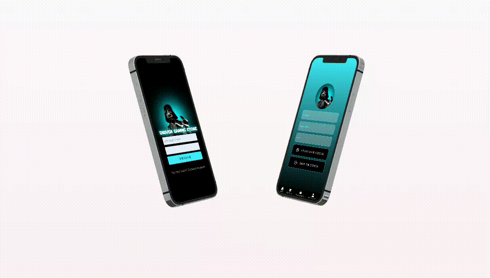

E-commerce Games (Driven Gamming Store) - usando ReactJS - NodeJS - MongoDB.

## Tecnologias 
Algumas tecnologias usadas:

* ReactJS
* NodeJS
* MongoDB
* Styled Components, Axios, DayJS...

## Serviços
* Github
* Vercel
* Mongo Atlas
* Heroku
  
## Visão Geral do Projeto:

## Recursos
  - Layout Responsivo (Desktop, Tablet, Mobile) 🖥️
  - Criar uma conta na Loja ✨
  - Adicionar item ao Carrinho de compras 🛒
  - Finalizar Pedido 💳
  - Receber informações do pedido via Email **(Em desenvolvimento ⏳)**
  - Atualizar dados do Cadastro **(Em desenvolvimento ⏳)**
  
## Links
  - Deploy Vercel: ***https://driven-gaming-store.vercel.app/***
  - Repositório FrontEnd: ***https://github.com/Pedro-Hen46/driven-gaming-store***
  - Repositório BackEnd: ***https://github.com/Pedro-Hen46/driven-gaming-store-back***

  ## Autores

  * **Pedro Henrique dos Santos Silva** 
  
   
  
  Me siga no [**Github**](https://github.com/login?return_to=https%3A%2F%2Fgithub.com%2FPedro-Hen46) e Faça uma conexão no [**LinkedIn**](https://www.linkedin.com/in/pedro-henrique-dos-santos-silva-05012289) ❤

  Obrigado por visitar. 
